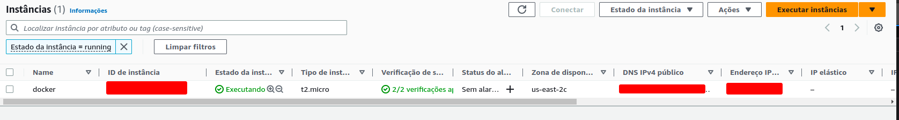
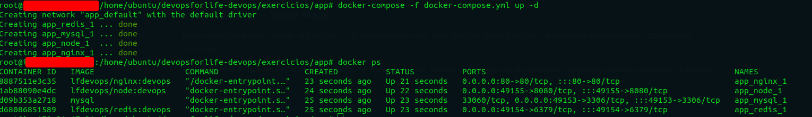
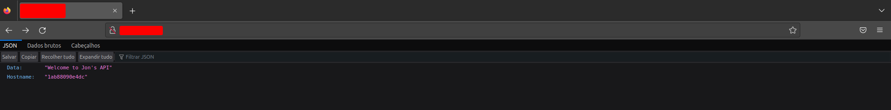
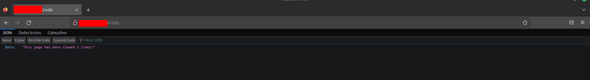

## docker-devops-ninja
## Repositório contendo exercício de docker praticado no curso DevOps Ninja <br />

Nesta atividade foi proposto a criação de 3 conteineres(nginx, node e redis) que se comunicassem entre si dentro de uma EC2 na AWS.<br />

A atividade foi executada da seguinte forma:
- Criação de uma EC2 na AWS
<br />

- Executado o arquivo docker-compose na vm:
```sh
$ docker-compose -f docker-compose.yml up -d
$ docker ps
```
<br />

Aplicação Node rodando no NGINX
<br />

Aplicação REDIS comunicando com a API Node
<br />
